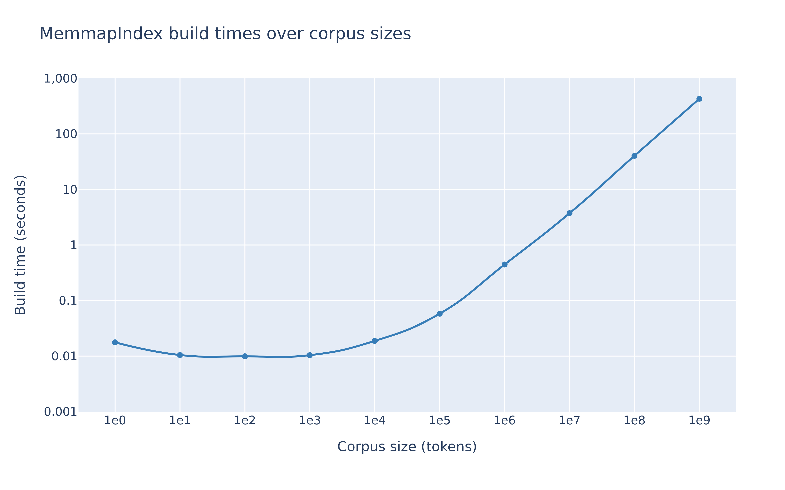
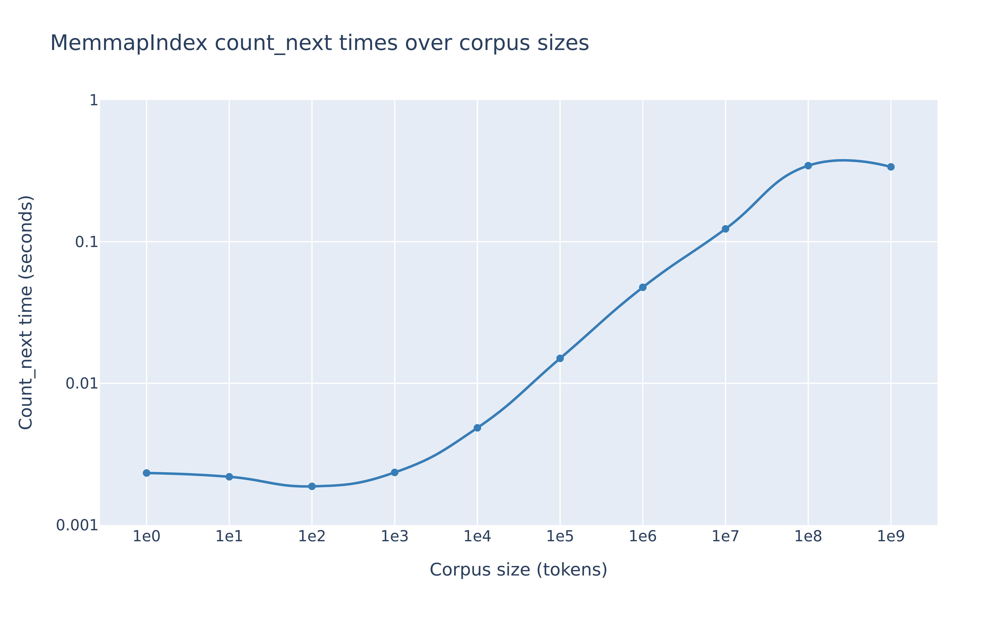

# Tokengrams
Tokengrams allows you to efficiently compute $n$-gram statistics for pre-tokenized text corpora used to train large language models. It does this not by explicitly pre-computing the $n$-gram counts for fixed $n$, but by creating a [suffix array](https://en.wikipedia.org/wiki/Suffix_array) index which allows you to efficiently compute the count of an $n$-gram on the fly for any $n$.

Our code also allows you to turn your suffix array index into an efficient $n$-gram language model, which can be used to generate text or compute the perplexity of a given text.

The backend is written in Rust, and the Python bindings are generated using [PyO3](https://github.com/PyO3/pyo3).

# Installation

```bash
pip install tokengrams
```

# Usage

Tokengrams builds indices from on-disk corpora of either u16 or u32 tokens, supporting a maximum vocabulary size of 2^32. In practice, however, vocabulary size is limited by the length of the largest word size vector the machine can allocate in memory. 

Corpora with vocabulary sizes smaller than 2^16 must use u16 tokens.

## Building an index
```python
from tokengrams import MemmapIndex
from huggingface_hub import HfApi, hf_hub_download

# Get a dataset formatted as u16 tokens
hf_hub_download(
  repo_id="EleutherAI/pile-standard-pythia-preshuffled", 
  repo_type="dataset", 
  filename="document-00000-of-00020.bin", 
  local_dir="."
)

# Create a new index from an on-disk corpus of u16 tokens and save it to a .idx file. 
# Set verbose to true to include a progress bar for the index sort.
index = MemmapIndex.build(
    "document-00000-of-00020.bin",
    "document-00000-of-00020.idx",
    vocab=2**16,
    verbose=True
)

# True for any valid index.
print(index.is_sorted())
  
# Get the count of "hello world" in the corpus.
from transformers import AutoTokenizer

tokenizer = AutoTokenizer.from_pretrained("EleutherAI/pythia-160m")
print(index.count(tokenizer.encode("hello world")))

# You can now load the index from disk later using __init__
index = MemmapIndex(
    "document-00000-of-00020.bin",
    "document-00000-of-00020.idx",
    vocab=2**17
)
```

## Using an index

```python
# Count how often each token in the corpus succeeds "hello world".
print(index.count_next(tokenizer.encode("hello world")))

# Parallelise over queries
print(index.batch_count_next(
    [tokenizer.encode("hello world"), tokenizer.encode("hello universe")]
))

# Autoregressively sample 10 tokens using 5-gram language statistics. Initial
# gram statistics are derived from the query, with lower order gram statistics used 
# until the sequence contains at least 5 tokens.
print(index.sample(tokenizer.encode("hello world"), n=5, k=10))

# Parallelize over sequence generations
print(index.batch_sample(tokenizer.encode("hello world"), n=5, k=10, num_samples=20))

# Query whether the corpus contains "hello world"
print(index.contains(tokenizer.encode("hello world")))

# Get all n-grams beginning with "hello world" in the corpus
print(index.positions(tokenizer.encode("hello world")))
```

## Scaling

Corpora small enough to fit in memory can use an InMemoryIndex:

```python
from tokengrams import InMemoryIndex

tokens = [0, 1, 2, 3, 4]
index = InMemoryIndex(tokens, vocab=5)
```

Larger corpora must use a MemmapIndex.

Many systems struggle with memory mapping extremely large tables (e.g. 40 billion tokens), causing unexpected bus errors. To prevent this split the corpus into shards then use a ShardedMemmapIndex to sort and query the table shard by shard:

```python
from tokengrams import ShardedMemmapIndex
from pathlib import Path
from huggingface_hub import HfApi, hf_hub_download

# Get sharded corpus of u16 tokens
repo_id = "EleutherAI/pile-standard-pythia-preshuffled"
repo_type = "dataset"

bin_files = [
  file for file in HfApi().list_repo_files(repo_id, repo_type=repo_type) 
  if file.endswith('.bin')
]

for file in bin_files:
    hf_hub_download(repo_id=repo_id, repo_type=repo_type, filename=file, local_dir=".")

# Build sharded index
files = [
    (file, f'{file.rstrip('.bin')}.idx'),
    for file in bin_files
]
index = ShardedMemmapIndex.build(files, vocab=2**17, verbose=True)
```

## Performance

Index build times for in-memory corpora scale inversely with the number of available CPU threads, whereas if the index reads from or writes to a file it is likely to be IO bound.

The time complexities of count_next(query) and sample_unsmoothed(query) are O(n log n), where n is ~ the number of completions for the query. The time complexity of sample_smoothed(query) is O(m n log n) where m is the n-gram order.

<table>
  <tr>
    <td></td>
    <td></td>
  </tr>
</table>

# Development

```bash
cargo build
cargo test
```

Develop Python bindings:

```bash
pip install maturin
maturin develop
pytest
```

# Support

The best way to get support is to open an issue on this repo or post in #inductive-biases in the [EleutherAI Discord server](https://discord.gg/eleutherai). If you've used the library and have had a positive (or negative) experience, we'd love to hear from you!